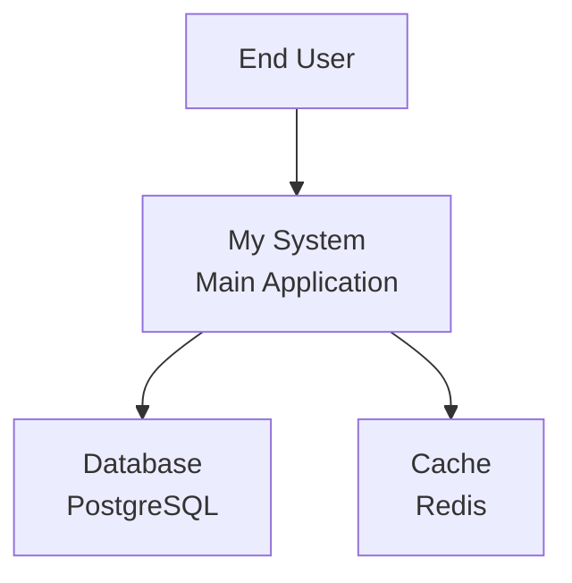
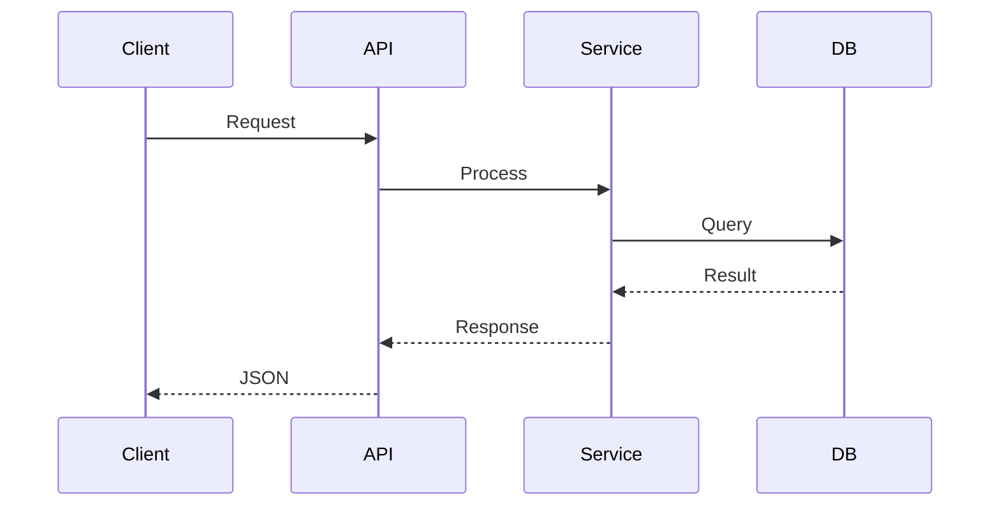

# Diagram Generation Service

## Overview
The Diagram Generator creates visual representations of system architecture, data flow, and relationships using Mermaid syntax for easy integration into markdown documentation.

## Supported Diagram Types

### 1. C4 Model Diagrams

#### Context Diagram (Level 1)
```yaml
c4_context:
  purpose: Show system in context with external entities
  elements:
    - systems
    - external_users
    - external_systems

  mermaid_template: |
    graph TB
      subgraph "System Context"
        System["{system_name}<br/>System"]
      end

      {{#each external_users}}
      User_{id}["{name}<br/>User"] --> System
      {{/each}}

      {{#each external_systems}}
      System --> ExtSystem_{id}["{name}<br/>External System"]
      {{/each}}
```

#### Container Diagram (Level 2)
```yaml
c4_container:
  purpose: Show high-level technology choices
  elements:
    - applications
    - databases
    - message_queues
    - web_servers

  mermaid_template: |
    graph TB
      subgraph "Container Diagram"
        {{#each containers}}
        {id}["{name}<br/>{technology}<br/>Container"]
        {{/each}}
      end

      {{#each relationships}}
      {from} -->|"{label}"| {to}
      {{/each}}
```

#### Component Diagram (Level 3)
```yaml
c4_component:
  purpose: Show component structure within containers
  elements:
    - controllers
    - services
    - repositories
    - interfaces

  mermaid_template: |
    graph TB
      subgraph "{container_name}"
        {{#each components}}
        {id}["{name}<br/>{type}"]
        {{/each}}
      end

      {{#each dependencies}}
      {from} --> {to}
      {{/each}}
```

### 2. Sequence Diagrams

#### API Request Flow
```yaml
sequence_api:
  template: |
    sequenceDiagram
      participant Client
      participant API
      participant Service
      participant Database

      {{#each interactions}}
      {from}->>+{to}: {message}
      {{#if response}}
      {to}-->>-{from}: {response}
      {{/if}}
      {{/each}}

  example: |
    sequenceDiagram
      participant Client
      participant API
      participant AuthService
      participant UserService
      participant DB

      Client->>+API: POST /login
      API->>+AuthService: validateCredentials()
      AuthService->>+DB: SELECT user
      DB-->>-AuthService: user data
      AuthService-->>-API: token
      API-->>-Client: 200 OK {token}
```

### 3. Class Diagrams

#### Object-Oriented Structure
```yaml
class_diagram:
  template: |
    classDiagram
      {{#each classes}}
      class {name} {
        {{#each attributes}}
        {visibility}{type} {name}
        {{/each}}
        {{#each methods}}
        {visibility}{name}({params}) {return_type}
        {{/each}}
      }
      {{/each}}

      {{#each relationships}}
      {from} {relationship_type} {to} : {label}
      {{/each}}

  relationship_types:
    inheritance: "--|>"
    composition: "--*"
    aggregation: "--o"
    association: "-->"
    dependency: "..>"
    realization: "..|>"
```

### 4. Entity Relationship Diagrams

#### Database Schema
```yaml
er_diagram:
  template: |
    erDiagram
      {{#each entities}}
      {name} {
        {{#each attributes}}
        {type} {name} {constraints}
        {{/each}}
      }
      {{/each}}

      {{#each relationships}}
      {from} {cardinality} {to} : "{label}"
      {{/each}}

  cardinality_types:
    one_to_one: "||--||"
    one_to_many: "||--o{"
    many_to_many: "}o--o{"
    zero_or_one: "|o--||"
    zero_or_many: "}o--||"
```

### 5. Data Flow Diagrams

#### System Data Flow
```yaml
data_flow:
  template: |
    graph LR
      {{#each processes}}
      {id}["{name}<br/>Process"]
      {{/each}}

      {{#each data_stores}}
      {id}[("{name}<br/>Data Store")]
      {{/each}}

      {{#each external_entities}}
      {id}[/"{name}<br/>External"\]
      {{/each}}

      {{#each flows}}
      {from} -->|"{data}"| {to}
      {{/each}}
```

### 6. State Diagrams

#### Application State
```yaml
state_diagram:
  template: |
    stateDiagram-v2
      {{#each states}}
      {{#if initial}}
      [*] --> {name}
      {{/if}}
      {name} : {description}
      {{/each}}

      {{#each transitions}}
      {from} --> {to} : {event}
      {{/each}}

      {{#each final_states}}
      {name} --> [*]
      {{/each}}
```

### 7. Deployment Diagrams

#### Infrastructure Layout
```yaml
deployment:
  template: |
    graph TB
      subgraph "Production Environment"
        subgraph "Cloud Provider"
          {{#each nodes}}
          {id}["{name}<br/>{type}"]
          {{/each}}
        end
      end

      {{#each connections}}
      {from} -->|"{protocol}"| {to}
      {{/each}}
```

## Diagram Generation Pipeline

### 1. Data Collection
```yaml
collection:
  sources:
    - code_analysis: Extract classes, functions, dependencies
    - config_files: Parse deployment configurations
    - api_specs: Read OpenAPI/Swagger definitions
    - database_schemas: Analyze migration files
    - documentation: Parse existing architecture docs
```

### 2. Relationship Mapping
```yaml
mapping:
  dependency_analysis:
    - import_statements
    - function_calls
    - class_inheritance
    - interface_implementation

  data_flow_analysis:
    - api_calls
    - database_queries
    - message_passing
    - event_emissions

  deployment_analysis:
    - docker_compose
    - kubernetes_manifests
    - terraform_configs
    - ci_cd_pipelines
```

### 3. Diagram Composition
```yaml
composition:
  layout_optimization:
    algorithm: hierarchical
    direction: top_to_bottom
    spacing: balanced
    grouping: logical_components

  complexity_management:
    max_nodes: 20
    abstraction_levels: 3
    detail_on_demand: true
    separate_concerns: true
```

### 4. Mermaid Generation
```yaml
generation:
  syntax_version: "10.0.0"
  theme: default
  config:
    flowchart:
      curve: basis
      padding: 10
    sequence:
      mirrorActors: false
      messageAlign: center
    class:
      defaultRenderer: dagre
```

## Smart Diagram Creation

### Automatic Architecture Detection
```python
class ArchitectureDetector:
    def detect_architecture(self, analysis_result):
        """Detect architecture pattern from code analysis."""
        patterns = {
            'microservices': self.check_microservices,
            'monolithic': self.check_monolithic,
            'serverless': self.check_serverless,
            'mvc': self.check_mvc,
            'layered': self.check_layered,
        }

        detected = []
        for pattern, checker in patterns.items():
            if checker(analysis_result):
                detected.append(pattern)

        return detected

    def check_microservices(self, analysis):
        indicators = [
            'multiple_services' in analysis,
            'docker_compose' in analysis.get('config_files', []),
            'kubernetes' in analysis.get('deployment', {}),
            len(analysis.get('api_endpoints', [])) > 20,
        ]
        return sum(indicators) >= 2

    def generate_appropriate_diagrams(self, architecture_type):
        """Generate diagrams based on architecture type."""
        diagram_sets = {
            'microservices': ['c4_context', 'c4_container', 'sequence', 'deployment'],
            'monolithic': ['c4_component', 'class', 'er', 'data_flow'],
            'serverless': ['c4_context', 'sequence', 'state', 'deployment'],
        }
        return diagram_sets.get(architecture_type, ['c4_context', 'class'])
```

### Intelligent Relationship Discovery
```python
class RelationshipAnalyzer:
    def analyze_relationships(self, codebase):
        """Discover relationships between components."""
        relationships = {
            'dependencies': self.find_dependencies,
            'inheritance': self.find_inheritance,
            'composition': self.find_composition,
            'data_flow': self.trace_data_flow,
            'api_calls': self.track_api_calls,
        }

        result = {}
        for rel_type, analyzer in relationships.items():
            result[rel_type] = analyzer(codebase)

        return result

    def find_dependencies(self, codebase):
        """Find import and usage dependencies."""
        deps = []
        for file in codebase.files:
            imports = self.extract_imports(file)
            for imp in imports:
                deps.append({
                    'from': file.module_name,
                    'to': imp.module,
                    'type': 'import'
                })
        return deps
```

## Usage API

### Basic Usage
```python
# Initialize generator
generator = DiagramGenerator()

# Generate from code analysis
analysis = CodeAnalyzer(project_root).analyze()
diagrams = generator.from_analysis(analysis)

# Generate specific diagram
context_diagram = generator.create_c4_context(
    system_name="My System",
    external_users=["Customer", "Admin"],
    external_systems=["Payment Gateway", "Email Service"]
)

# Get Mermaid syntax
mermaid_code = context_diagram.to_mermaid()
```

### Advanced Usage
```python
# Configure generator
generator = DiagramGenerator(
    config={
        'max_complexity': 'medium',
        'auto_layout': True,
        'include_legends': True,
        'color_scheme': 'blue',
        'direction': 'LR',
    }
)

# Generate with custom template
custom_template = """
graph TB
    {{#each components}}
    {id}["{custom_label}"]
    {{/each}}
"""

diagram = generator.from_template(
    custom_template,
    data={'components': components}
)

# Batch generation
all_diagrams = generator.generate_all(
    analysis_result,
    diagram_types=['c4', 'sequence', 'class', 'deployment']
)
```

## Integration with Documentation

### Markdown Embedding
```markdown
## System Architecture

<!-- diagram:c4-context -->

<!-- /diagram:c4-context -->

## API Flow

<!-- diagram:sequence -->

<!-- /diagram:sequence -->
```

### Dynamic Diagram Updates
```yaml
update_strategy:
  triggers:
    - code_change
    - documentation_update
    - manual_refresh

  incremental:
    enabled: true
    cache_previous: true
    highlight_changes: true

  versioning:
    track_history: true
    compare_versions: true
    changelog: auto_generate
```

## Styling and Themes

### Mermaid Themes
```yaml
themes:
  default:
    primary_color: "#0066cc"
    secondary_color: "#f0f0f0"
    font_family: "Arial"

  dark:
    primary_color: "#bb86fc"
    secondary_color: "#121212"
    font_family: "Monaco"

  corporate:
    primary_color: "#003366"
    secondary_color: "#ffffff"
    font_family: "Helvetica"
```

### Custom Styling
```css
/* Custom Mermaid CSS */
.node {
    fill: #f9f9f9;
    stroke: #333;
    stroke-width: 2px;
}

.edgeLabel {
    background-color: white;
    padding: 2px;
}

.cluster {
    fill: #ffffde;
    stroke: #aaaa33;
    stroke-width: 1px;
}
```

## Performance Optimization

### Caching Strategy
```yaml
cache:
  diagram_cache:
    enabled: true
    ttl: 3600
    key: "{analysis_hash}_{diagram_type}"

  rendered_cache:
    enabled: true
    format: svg
    storage: memory

  invalidation:
    on_code_change: true
    on_config_change: true
    manual_refresh: true
```

### Complexity Management
```yaml
complexity:
  simplification_rules:
    too_many_nodes:
      threshold: 30
      action: create_sub_diagrams

    too_many_edges:
      threshold: 50
      action: group_related

    deep_nesting:
      threshold: 5
      action: flatten_hierarchy

  abstraction_levels:
    high: Show only main components
    medium: Include important details
    low: Show all details
```

## Error Handling

### Common Issues
```yaml
errors:
  invalid_syntax:
    recovery: fallback_to_simple
    message: "Invalid Mermaid syntax, using simplified diagram"

  too_complex:
    recovery: split_diagram
    message: "Diagram too complex, splitting into parts"

  missing_data:
    recovery: skip_section
    message: "Insufficient data for {diagram_type}"

  render_failure:
    recovery: text_representation
    message: "Cannot render diagram, showing text version"
```

## Testing

### Unit Tests
```python
def test_c4_context_generation():
    """Test C4 context diagram generation."""
    generator = DiagramGenerator()

    diagram = generator.create_c4_context(
        system_name="TestSystem",
        external_users=["User"],
        external_systems=["ExtSystem"]
    )

    mermaid = diagram.to_mermaid()
    assert "TestSystem" in mermaid
    assert "User" in mermaid
    assert "ExtSystem" in mermaid
    assert "graph TB" in mermaid
```

### Visual Regression Tests
```python
def test_diagram_visual_consistency():
    """Test diagram visual output consistency."""
    generator = DiagramGenerator()

    # Generate diagram
    diagram = generator.create_class_diagram(classes)
    svg_output = diagram.render_svg()

    # Compare with baseline
    baseline = load_baseline("class_diagram_baseline.svg")
    assert visual_diff(svg_output, baseline) < 0.01
```

## Best Practices

1. **Simplicity First**: Start with high-level diagrams
2. **Progressive Detail**: Add complexity only when needed
3. **Consistent Notation**: Use standard symbols and patterns
4. **Clear Labels**: Use descriptive, concise labels
5. **Logical Grouping**: Group related components
6. **Color Coding**: Use colors to convey meaning
7. **Version Control**: Track diagram changes
8. **Documentation**: Explain diagram conventions
9. **Accessibility**: Provide text alternatives
10. **Regular Updates**: Keep diagrams current with code