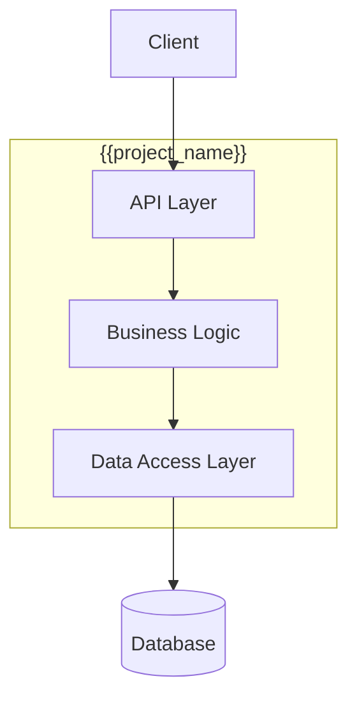
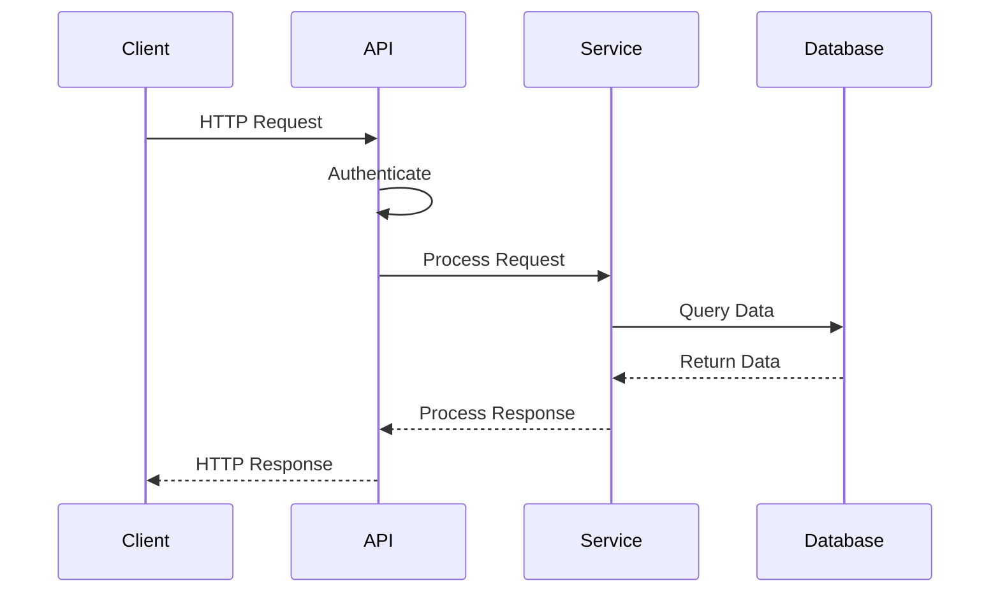
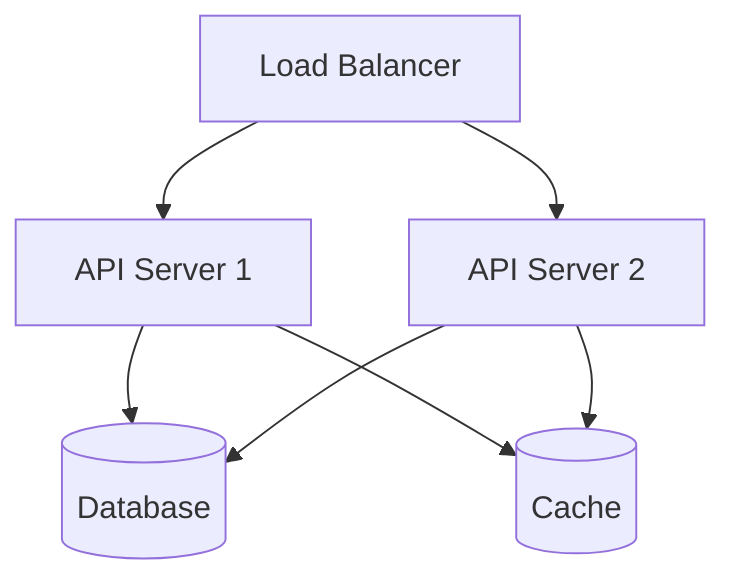

# {{project_name}} Architecture Documentation

> System architecture and design documentation

---

## Table of Contents

- [Overview](#overview)
- [System Context](#system-context)
- [Component Architecture](#component-architecture)
- [Data Flow](#data-flow)
- [Deployment Architecture](#deployment-architecture)
- [Security Architecture](#security-architecture)
- [Design Decisions](#design-decisions)

---

## Overview

### System Purpose

{{system_purpose}}

### Key Architectural Goals

- {{goal_1}}
- {{goal_2}}
- {{goal_3}}

### Technology Stack

| Layer | Technology | Purpose |
|-------|------------|---------|
| {{layer_1}} | {{tech_1}} | {{purpose_1}} |
| {{layer_2}} | {{tech_2}} | {{purpose_2}} |
| {{layer_3}} | {{tech_3}} | {{purpose_3}} |

---

## System Context

### System Boundary

```mermaid
graph TB
    User[User/Client] --> System[{{project_name}}]
    System --> DB[(Database)]
    System --> Cache[(Cache)]
    System --> External[External API]

    style System fill:#4A90E2,stroke:#333,stroke-width:2px
```

### External Dependencies

- **{{dependency_1}}**: {{dep_1_purpose}}
- **{{dependency_2}}**: {{dep_2_purpose}}
- **{{dependency_3}}**: {{dep_3_purpose}}

---

## Component Architecture

### High-Level Components



### Core Components

#### {{component_1_name}}

**Responsibility:** {{component_1_responsibility}}

**Key Features:**
- {{feature_1}}
- {{feature_2}}
- {{feature_3}}

**Dependencies:**
- {{component_1_dep_1}}
- {{component_1_dep_2}}

**Technology:** {{component_1_tech}}

---

#### {{component_2_name}}

**Responsibility:** {{component_2_responsibility}}

**Key Features:**
- {{feature_1}}
- {{feature_2}}

**Dependencies:**
- {{component_2_dep_1}}

**Technology:** {{component_2_tech}}

---

## Data Flow

### Request/Response Flow



### Data Processing Pipeline

{{data_pipeline_description}}

1. **Input Stage**: {{input_stage_desc}}
2. **Processing Stage**: {{processing_stage_desc}}
3. **Output Stage**: {{output_stage_desc}}

---

## Deployment Architecture

### Deployment Topology



### Infrastructure Requirements

| Component | Specification | Scaling |
|-----------|---------------|---------|
| {{infra_component_1}} | {{spec_1}} | {{scaling_1}} |
| {{infra_component_2}} | {{spec_2}} | {{scaling_2}} |
| {{infra_component_3}} | {{spec_3}} | {{scaling_3}} |

### Deployment Process

{{deployment_process_description}}

---

## Security Architecture

### Authentication & Authorization

**Authentication Method:** {{auth_method}}

**Authorization Model:** {{authz_model}}

### Security Layers

1. **Network Security**: {{network_security}}
2. **Application Security**: {{app_security}}
3. **Data Security**: {{data_security}}

### Security Best Practices

- ✅ {{security_practice_1}}
- ✅ {{security_practice_2}}
- ✅ {{security_practice_3}}

---

## Design Decisions

### ADR-001: {{decision_1_title}}

**Status:** {{decision_1_status}}
**Date:** {{decision_1_date}}

**Context:**

{{decision_1_context}}

**Decision:**

{{decision_1_decision}}

**Rationale:**

- {{rationale_1}}
- {{rationale_2}}

**Consequences:**

- ✅ Positive: {{positive_consequence_1}}
- ⚠️ Negative: {{negative_consequence_1}}

**Alternatives Considered:**

- {{alternative_1}}: {{why_not_1}}
- {{alternative_2}}: {{why_not_2}}

---

### ADR-002: {{decision_2_title}}

**Status:** {{decision_2_status}}
**Date:** {{decision_2_date}}

**Context:**

{{decision_2_context}}

**Decision:**

{{decision_2_decision}}

**Rationale:**

- {{rationale_1}}
- {{rationale_2}}

---

## Scalability Considerations

### Horizontal Scaling

{{horizontal_scaling_description}}

### Performance Optimization

- {{optimization_1}}
- {{optimization_2}}
- {{optimization_3}}

### Monitoring & Observability

**Metrics Tracked:**
- {{metric_1}}
- {{metric_2}}
- {{metric_3}}

**Logging Strategy:** {{logging_strategy}}

---

## Future Improvements

- 🔮 {{future_1}}
- 🔮 {{future_2}}
- 🔮 {{future_3}}

---

*Generated with BMAD Tech Writer*